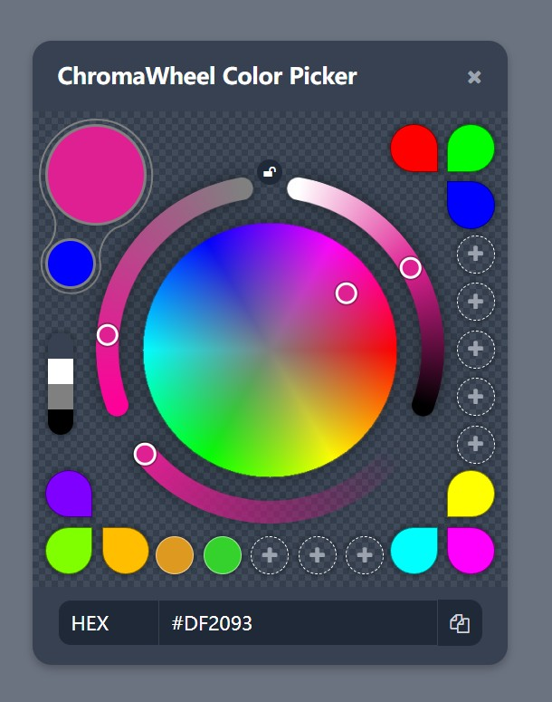

# ChromaWheel Color Picker

一个功能强大、直观易用的颜色选择器组件，具有色相轮界面、参数调整、多种颜色格式支持和用户友好的交互体验。

### 在线预览
可以通过以下链接在线体验ChromaWheel Color Picker：
[http://webhost.snkj.xyz/users/fiction/ChromaWheel/](http://webhost.snkj.xyz/users/fiction/ChromaWheel/)

## 主要功能
- **色相轮界面**：360度全方位色相选择，支持点击和拖拽操作
- **环形分段控制器**：创新设计的分段环弧，包含饱和度、亮度和透明度控制
- **多种颜色格式**：实时支持HEX、RGB、RGBA、HSL、HSLA格式转换与显示
- **用户体验优化**：预设颜色、颜色收藏功能、本地存储、一键复制到剪贴板、背景色切换、饱和度锁定
- **交互支持**：完全支持鼠标点击拖拽和触摸滑动操作，适配桌面和移动设备
- **现代设计**：响应式界面，流畅动画效果，扁平化UI设计

## 使用方法
1. 在颜色圆盘上选择基础色相和饱和度
2. 使用环形控制器调整饱和度、亮度和透明度
3. 通过下拉菜单切换颜色格式
4. 点击复制按钮快速复制颜色值
5. 点击空白收藏位保存颜色，点击已收藏颜色应用，右键或拖出删除

## 项目组成
- `ChromaWheel.html`：主文件，包含完整代码
- `demo.jpg`：演示图片
- `README.md`：项目说明
- `LICENSE`：许可证文件

## 技术实现
采用HTML5、JavaScript、Font Awesome构建，支持Chrome、Firefox、Safari和Edge等现代浏览器。

欢迎开发者基于此HTML实现，改造成各种前端组件库的版本（如React、Vue、Angular等）。

## 许可证
Apache License Version 2.0

---

# ChromaWheel Color Picker

A powerful and intuitive color picker component featuring a hue wheel interface, parameter adjustment, multi-format support, and user-friendly interaction.

### Online Preview
You can experience ChromaWheel Color Picker online through the following link:
[http://webhost.snkj.xyz/users/fiction/ChromaWheel/](http://webhost.snkj.xyz/users/fiction/ChromaWheel/)

## Key Features
- **Hue Wheel Interface**: 360° hue selection with click and drag support
- **Segmented Ring Controllers**: Innovative design with saturation, lightness, and opacity controls
- **Multiple Color Formats**: Real-time HEX, RGB, RGBA, HSL, HSLA conversion and display
- **Enhanced UX**: Preset colors, favorites system, local storage, one-click copy, background switching, saturation lock
- **Interaction Support**: Full support for mouse click-drag and touch swipe operations, compatible with desktop and mobile devices
- **Modern Design**: Responsive interface, smooth animations, flat UI

## Usage
1. Select base hue and saturation on the color wheel
2. Adjust parameters using the ring controllers
3. Switch color formats via dropdown menu
4. Quick copy color values with the copy button
5. Save colors by clicking empty favorite slots, apply by clicking filled slots, delete with right-click or drag

## Project Contents
- `ChromaWheel.html`: Main file with complete code
- `demo.jpg`: Demo image
- `README.md`: Project documentation
- `LICENSE`: License file

## Technology
Built with HTML5, JavaScript, Tailwind CSS and Font Awesome, compatible with modern browsers like Chrome, Firefox, Safari and Edge.

Developers are welcome to adapt this HTML implementation into various frontend component library versions (such as React, Vue, Angular, etc.).

## License
Apache License Version 2.0

## License
Apache License Version 2.0
